# relievo

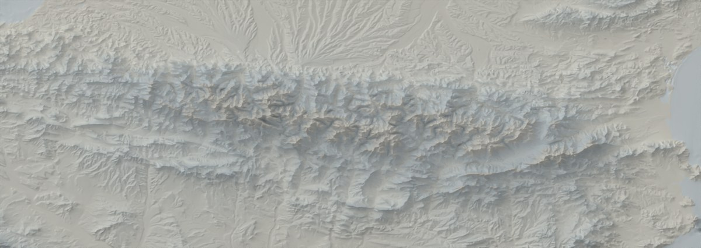

`relievo` is a CLI that drives [Daniel Huffman's](https://somethingaboutmaps.wordpress.com/2017/11/16/creating-shaded-relief-in-blender/) shaded relief workflow without touching Blender's GUI. Give it a geographic bounding box and a `.blend` template and it downloads the elevation data, prepares the DEM, runs Blender headlessly and delivers a render. Add `--color-relief` for a hypsometric colour tint, `--clip-mask` to cut the result to your exact polygon and `--color-relief-mode separate` to get the composite *and* the raw colour layer - all scriptable, all reproducible.

`relievo` requires Blender installed locally and available in your `PATH` (or passed via `--blender`).

Think of it as the Blender shaded-relief workflow you already know, but without opening Blender, wiring nodes by hand, or clicking through half a dozen panels before your first render. Same idea, same cartographic spirit, just with a friendlier CLI and fewer opportunities to get lost in the interface.

> **Inspired by** Daniel Huffman's Blender method, [Nick Underwood's blenderize.sh](https://github.com/nunderwood6/blender_prep) and Kyaw Naing Win's [OpenTopography DEM Downloader](https://github.com/knwin/OpenTopography-DEM-Downloader-qgis-plugin) QGIS plugin - which pioneered bringing the OpenTopography API directly into a geospatial workflow.

<table>
  <tr>
    <th>Shaded relief</th>
    <th>Color layer</th>
    <th>Combined</th>
  </tr>
  <tr>
    <td>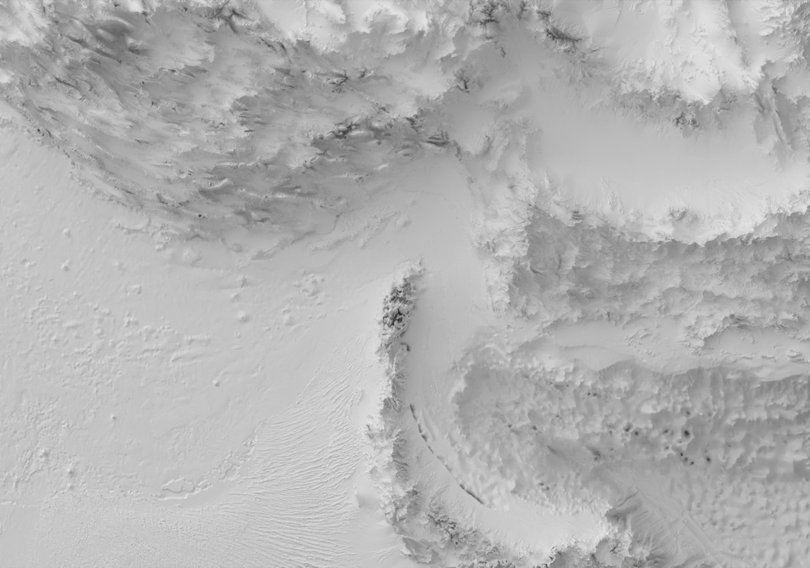</td>
    <td>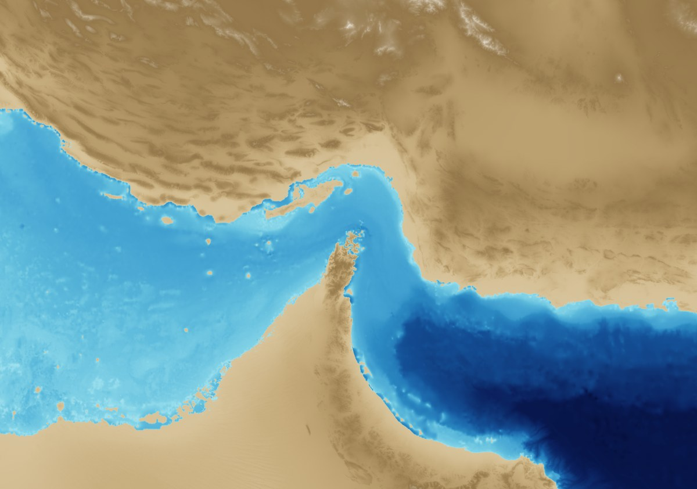</td>
    <td>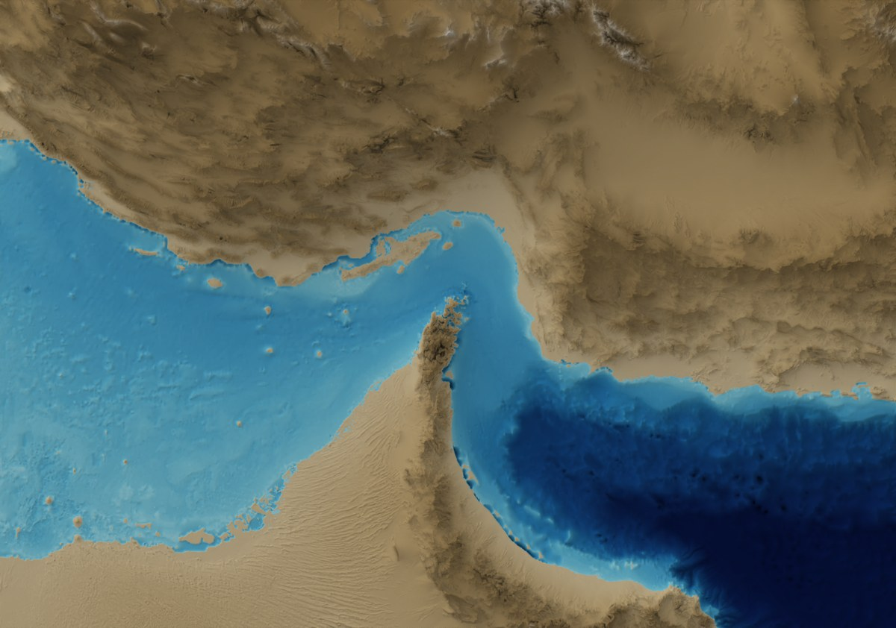</td>
  </tr>
</table>

And this is the Blender setup it automates behind the scenes, so you can keep the power and skip the interface gymnastics:

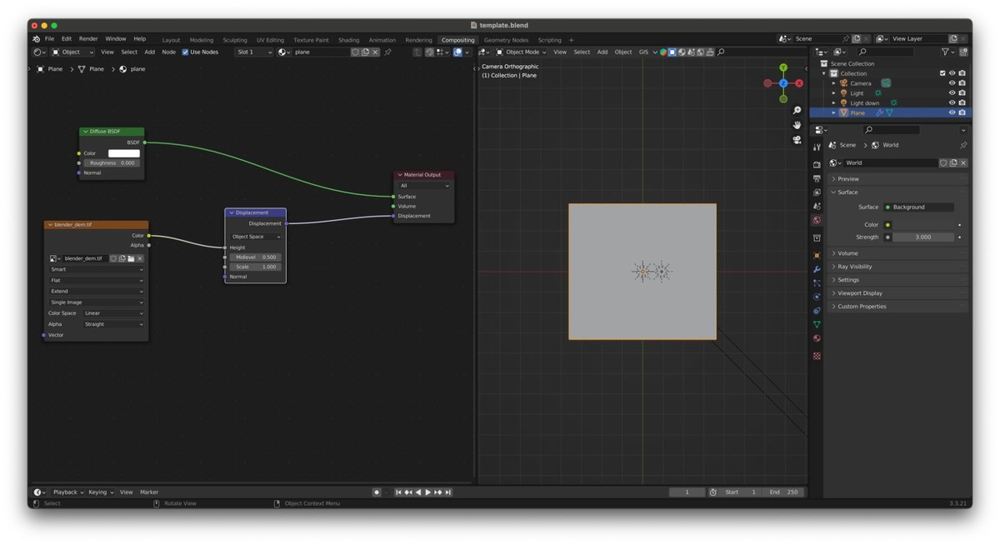

---

## Contents

- [Features](#features)
- [How it works](#how-it-works)
- [Installation](#installation)
- [Quick start](#quick-start)
- [All options](#all-options)
- [Workflows and examples](#workflows-and-examples)
- [Bounding box format](#bounding-box-format)
- [Creating your own Blender template](#creating-your-own-blender-template)
- [Colour ramp format](#colour-ramp-format)
- [Available DEM datasets](#available-dem-datasets)
- [OpenTopography API key](#opentopography-api-key)
- [Cartographic best practices](#cartographic-best-practices)
- [Tips and caveats](#tips-and-caveats)
- [Notes on authorship and tooling](#notes-on-authorship-and-tooling)

---

## Features

- **Zero GUI** - Blender runs headlessly; the whole pipeline is a single shell command.
- **Flexible DEM source** - download automatically from OpenTopography (SRTM 30 m / 90 m, NASADEM, Copernicus 30 m / 90 m, ALOS 30 m…) *or* bring your own GeoTIFF. An API key is only needed for the download step.
- **Hypsometric tint** - composites a colour-by-elevation layer over the render using multiply blending, with three output modes: `overlay`, `separate`, `both`.
- **Polygon clipping** - cuts the output to any GeoJSON polygon with full alpha transparency.
- **Configurable lighting** - override sun azimuth and altitude without touching Blender.
- **Vertical exaggeration** - dial in the drama.
- **Resolution control** - `--max-size` and `--scale` for everything from quick 10-second previews to print-quality renders.
- **TOML config profiles** - keep per-project defaults in a file; no more long commands.
- **Dry run** - preview the download size and pixel count before committing.
- **CRS reprojection** - reproject the DEM to any metric CRS before rendering.

---

## How it works

```
GeoJSON bbox
     │
     ▼
 Download DEM          ← OpenTopography API (optional - only needed without --dem)
 (or load local)       ← any GeoTIFF with --dem; no API key required
     │
     ▼
 Process DEM           ← reproject (optional), rescale to UInt16 (Blender-compatible)
     │
     ▼
 Blender (headless)    ← loads .blend template, applies DEM as displacement map
     │
     ▼
 Post-processing       ← hypsometric tint (gdaldem), polygon clip (Pillow)
     │
     ▼
 output.png
```

The Blender step follows the Daniel Huffman shaded relief method: the DEM drives a displacement map on a flat plane lit by a sun lamp; an orthographic camera renders the scene from above.

---

## Installation

### Prerequisites

| Dependency | Required for | How to install |
|---|---|---|
| Python ≥ 3.9 | core | conda / pyenv |
| GDAL ≥ 3.6 | DEM processing | **conda-forge only** |
| Blender ≥ 3.6 | rendering | [blender.org](https://www.blender.org/download/) |
| `gdaldem` | `--color-relief` | included with GDAL |
| OpenTopography API key | automatic DEM download | [opentopography.org](https://opentopography.org/developers) - free |

> GDAL must be installed through **conda-forge**. `pip install gdal` is not reliable.

### Conda (recommended)

```bash
git clone https://github.com/youruser/relievo.git
cd relievo

conda env create -f environment.yml
conda activate relievo
pip install -e .
```

### Manual

```bash
conda create -n relievo -c conda-forge python=3.11 gdal pyproj
conda activate relievo
pip install -e .
```

### Verify

```bash
relievo --help
relievo --list-demtypes
```

---

## Quick start

```bash
export OPENTOPO_API_KEY=your_key_here   # only needed if downloading the DEM automatically

relievo \
  --bbox examples/bboxes/tenerife_bbox.geojson \
  --template template.blend \
  --output tenerife.png
```

No API key? Pass your own DEM - no account needed:

```bash
relievo \
  --bbox examples/bboxes/tenerife_bbox.geojson \
  --template template.blend \
  --dem /data/my_dem.tif \
  --output tenerife.png
```

---

## All options

```
Usage: relievo [OPTIONS]

Options:
  --config FILE                TOML config file with default option values.
  --list-demtypes              List all available DEM datasets and exit.
  --bbox FILE                  GeoJSON bounding box polygon in WGS84.  [required]
  --template FILE              Path to the .blend template file.  [required]
  --output FILE                Output image path (.png, .jpg, .jpeg).  [default: output.png]
  --buffer FLOAT               Buffer added to bbox before downloading (e.g. 0.05 = 5%).
  --dem FILE                   Local DEM GeoTIFF - skips the download step entirely.
  --save-dem FILE              Save the raw downloaded DEM GeoTIFF for reuse with --dem.
  --save-processed-dem FILE    Save cropped/reprojected DEM in real metres (before UInt16 conversion).
  --crs TEXT                   Reproject DEM to this CRS before rendering (e.g. EPSG:32628).
  --demtype TEXT               OpenTopography dataset key.  [default: SRTMGL1]
  --api-key TEXT               OpenTopography API key (or OPENTOPO_API_KEY env var).
  --exaggeration FLOAT         Vertical exaggeration factor.
  --samples INT                Blender Cycles render samples.
  --max-size INT               Maximum pixels on the longest side of the output.
  --scale INT                  Render resolution percentage (1–100).  [default: 100]
  --light-azimuth FLOAT        Sun azimuth in degrees (0 = North, clockwise).
  --light-altitude FLOAT       Sun altitude in degrees (0 = horizon, 90 = overhead).
  --smooth FLOAT               DEM smoothing factor (>1). Blurs terrain before rendering.
  --color-relief FILE          gdaldem colour ramp file for hypsometric tint.
  --color-relief-mode TEXT     overlay | separate | both.  [default: overlay]
  --color-relief-blend TEXT    multiply | linearburn.  [default: multiply]
  --clip-mask                  Clip output to the GeoJSON polygon shape (RGBA).
  --worldfile                  Write georeferencing sidecars next to the output image (PGW/JGW/WLD + PRJ).
  --dry-run                    Print estimated download/render info and exit.
  --no-render                  Download and process DEM only; skip Blender.
  --blender PATH               Path to the Blender executable.
  --verbose                    Detailed progress log.
  --keep-workdir               Keep the temporary working directory after render.
  --help                       Show this message and exit.
```

---

## Gallery

All examples below use **`examples/bboxes/tenerife_bbox.geojson`** and **`dem.tif`** (pre-downloaded) as input. No API key required.

---

### Shaded relief only

```bash
relievo \
  --bbox examples/bboxes/tenerife_bbox.geojson \
  --template template.blend \
  --dem dem.tif \
  --output relieve.png
```


---

### + Hypsometric tint (`--color-relief-mode overlay`)

```bash
relievo \
  --bbox examples/bboxes/tenerife_bbox.geojson \
  --template template.blend \
  --dem dem.tif \
  --output relieve.png \
  --color-relief examples/ramp_terrain.txt
```


Alternative style using a QGIS-inspired elevation ramp:

```bash
relievo \
  --bbox examples/bboxes/tenerife_bbox.geojson \
  --template template.blend \
  --dem dem.tif \
  --output relieve_qgis.png \
  --color-relief examples/ramp_elevation_qgis.txt
```

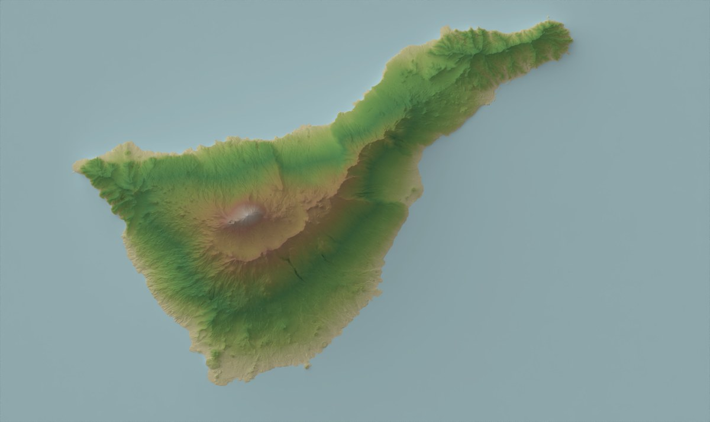

Alternative style with a subtler atlas look:

```bash
relievo \
  --bbox examples/bboxes/tenerife_bbox.geojson \
  --template template.blend \
  --dem dem.tif \
  --output relieve_subtle.png \
  --color-relief examples/ramp_subtle_atlas.txt
```

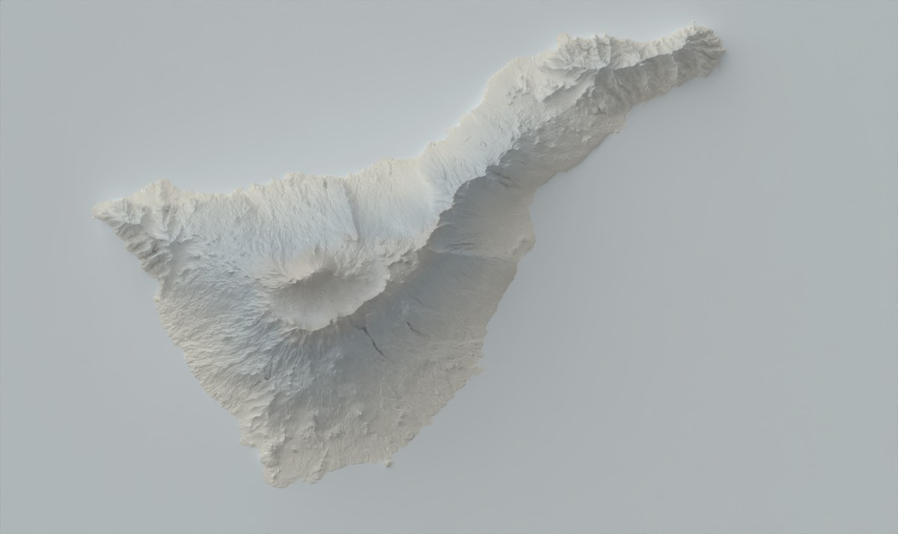

---

### Light from the NW vs south

```bash
# NW light - cartographic convention
relievo ... --light-azimuth 315 --light-altitude 35

# South light - dramatic, reveals north-facing slopes
relievo ... --light-azimuth 180 --light-altitude 18
```

| NW (315°, 35°) | South (180°, 18°) |
|---|---|
| 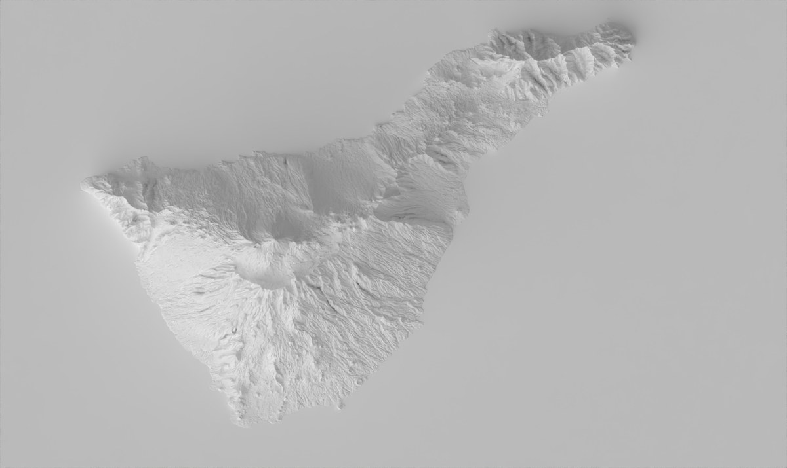 | 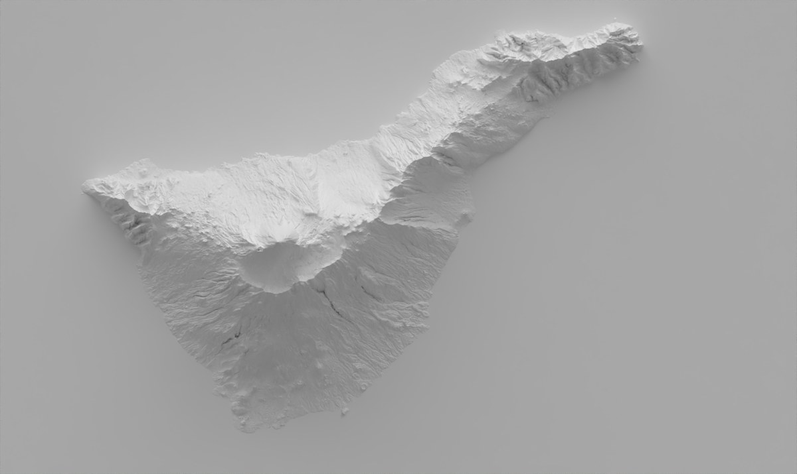 |

---

### `--color-relief-mode both` - composite + raw colour layer

```bash
relievo \
  --bbox examples/bboxes/tenerife_bbox.geojson \
  --template template.blend \
  --dem dem.tif \
  --output relieve.png \
  --color-relief examples/ramp_terrain.txt \
  --color-relief-mode both
# → relieve.png        shaded relief + tint
# → relieve_color.png  raw colour layer for further compositing
```

| Composite | Raw colour layer |
|---|---|
| 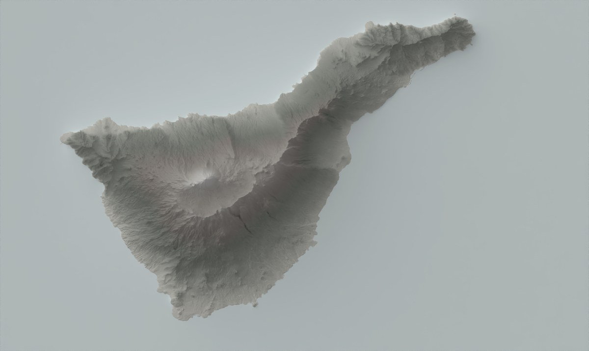 | 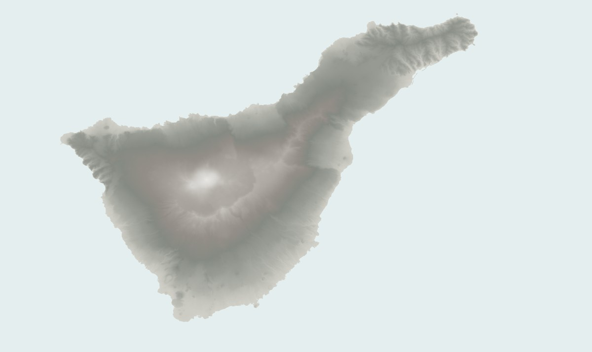 |

---

## Workflows and examples

### 1. Minimal - download + render

The simplest invocation. The OpenTopography API key is only used here.

```bash
relievo \
  --bbox examples/bboxes/tenerife_bbox.geojson \
  --template template.blend \
  --output tenerife.png
```

---

### 2. Using your own DEM

Skip the download entirely. Any GeoTIFF works - local surveys, IGN, Copernicus Land Monitor, USGS, whatever you have. No API key required.

```bash
relievo \
  --bbox examples/bboxes/tenerife_bbox.geojson \
  --template template.blend \
  --dem /data/mdt05-canarias.tif \
  --output tenerife.png
```

> `--bbox` is still used to crop the DEM to the area of interest.

---

### 3. Hypsometric colour tint

Composite a colour-by-elevation layer over the render. Requires `gdaldem` (ships with any GDAL install).

```bash
relievo \
  --bbox examples/bboxes/tenerife_bbox.geojson \
  --template template.blend \
  --output tenerife.png \
  --color-relief examples/ramp_terrain.txt
```

The included `examples/ramp_terrain.txt` covers −500 m (deep water) to 5 000 m (permanent snow). Edit elevation breakpoints and colours freely.

For brighter, less muddy composites (especially when preparing editable layers for PSD/AI), try the **Linear Burn + Screen** blend method shown by Daniel Huffman in his Photoshop tutorial (which he credits to techniques learned from **Tom Patterson** and **Tanya Buckingham**):

```bash
relievo \
  --bbox examples/bboxes/rectangle_iran.geojson \
  --dem examples/hormuz.tif \
  --template template.blend \
  --output hormuz_linearburn.jpg \
  --color-relief examples/ramp_hormuz.txt \
  --color-relief-mode both \
  --color-relief-blend linearburn
```

Quick visual comparison using the same Amazon test scene (`--bbox examples/bboxes/south_america.geojson --dem south_america.tif`):

<table>
  <tr>
    <th>Multiply (default)</th>
    <th>Linear Burn + Screen</th>
  </tr>
  <tr>
    <td>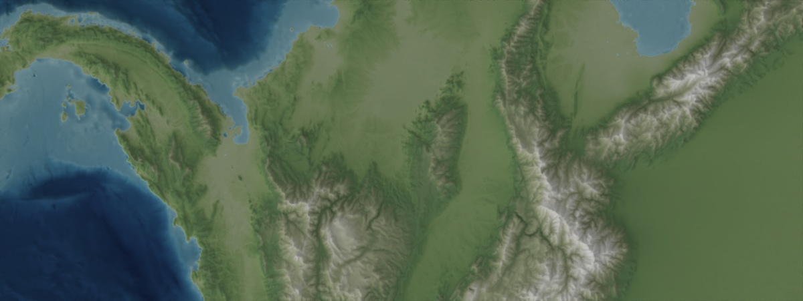</td>
    <td>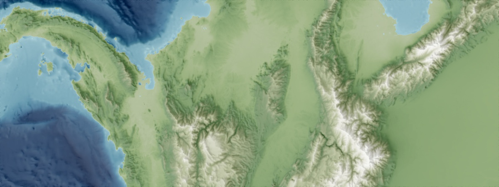</td>
  </tr>
</table>

Both runs can also export the raw colour layer (`--color-relief-mode both`) so you can finish compositing in PSD/AI:

- `docs/images/amazonas_multiply_color.jpg`
- `docs/images/amazonas_linearburn_color.jpg`

---

### 4. Separate colour layer for compositing

Get the shaded render and the colour layer as independent files - perfect for further compositing in Photoshop, Affinity Photo or GIMP.

```bash
# Both composite and raw colour layer
relievo \
  --bbox examples/bboxes/tenerife_bbox.geojson \
  --template template.blend \
  --output tenerife.png \
  --color-relief examples/ramp_terrain.txt \
  --color-relief-mode both
# → tenerife.png        shaded relief + tint composited
# → tenerife_color.png  raw colour layer, no shading

# Only the colour layer - render left untouched
relievo \
  --bbox examples/bboxes/tenerife_bbox.geojson \
  --template template.blend \
  --output tenerife.png \
  --color-relief examples/ramp_terrain.txt \
  --color-relief-mode separate
# → tenerife.png        shaded relief, untouched
# → tenerife_color.png  raw colour layer
```

---

### 5. Clip to an irregular polygon

Cut the output to any shape - coastlines, administrative boundaries, watersheds - with full alpha transparency.

```bash
relievo \
  --bbox examples/bboxes/tenerife.geojson \
  --template template.blend \
  --dem dem.tif \
  --color-relief examples/ramp_terrain.txt \
  --color-relief-mode overlay \
  --output tenerife_clipped.png \
  --clip-mask
```

The clip shape is taken from `--bbox`. For precise cuts, supply a polygon that follows the actual coastline or boundary rather than a rectangular bbox.

If you want to place the output directly in GIS software, add `--worldfile`:

```bash
relievo \
  --bbox examples/bboxes/tenerife_bbox.geojson \
  --template template.blend \
  --dem dem.tif \
  --output tenerife.jpg \
  --worldfile
# → tenerife.jgw
# → tenerife.prj
```

Worldfile sidecars are written with standard extensions: `.pgw` for PNG, `.jgw` for JPEG, plus a `.prj` file with CRS information.

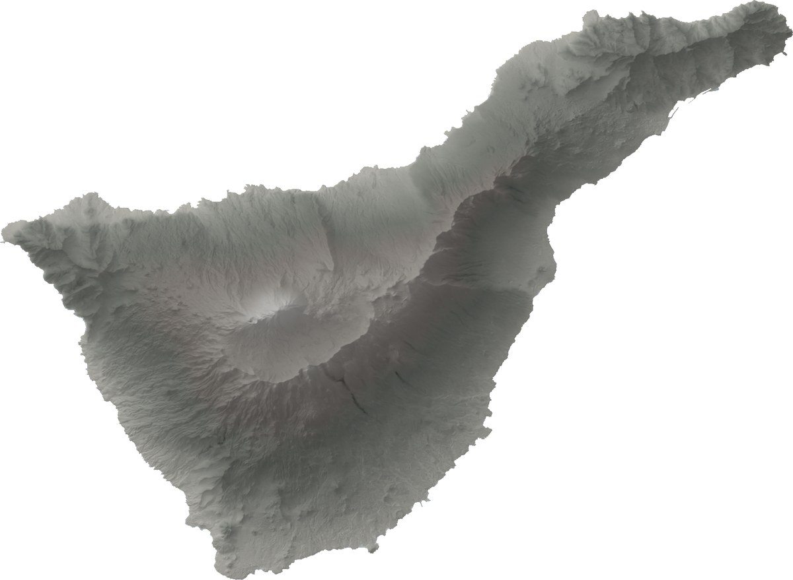

---

### 6. Custom sun position

Override the light direction without opening Blender.

```bash
# Classic NW light (standard cartographic convention)
relievo \
  --bbox examples/bboxes/tenerife_bbox.geojson \
  --template template.blend \
  --output tenerife_nw.png \
  --light-azimuth 315 \
  --light-altitude 35

# Low, dramatic south light
relievo \
  --bbox examples/bboxes/tenerife_bbox.geojson \
  --template template.blend \
  --output tenerife_south.png \
  --light-azimuth 180 \
  --light-altitude 15
```

---

### 7. Vertical exaggeration

Amplify or flatten terrain drama.

```bash
# Subtle - good for high-relief areas like the Alps or Tenerife
relievo --bbox ... --template ... --output out.png --exaggeration 0.6

# Strong - good for flat areas like deltas or coastal plains
relievo --bbox ... --template ... --output out.png --exaggeration 3.0
```

---

### 8. Smooth the DEM to reduce visual noise

For regional or national-scale maps, the raw DEM contains micro-terrain detail (sensor noise, interpolation artifacts, minor ridges) that at small scale reads as visual clutter rather than useful information. `--smooth` applies a low-pass filter - downsamples the DEM by the given factor (average resampling) then upsamples back (bilinear) - to merge that noise into broader, cleaner landform structures before rendering.

```bash
# No smoothing - every terrain artifact rendered at full fidelity
relievo \
  --bbox examples/bboxes/tenerife_bbox.geojson \
  --template template.blend \
  --dem dem.tif \
  --output tenerife_sharp.png

# Smooth factor 8 - major landform structures read more clearly
relievo \
  --bbox examples/bboxes/tenerife_bbox.geojson \
  --template template.blend \
  --dem dem.tif \
  --output tenerife_smooth.png \
  --smooth 8
```

| No smoothing | `--smooth 8` |
|:---:|:---:|
| 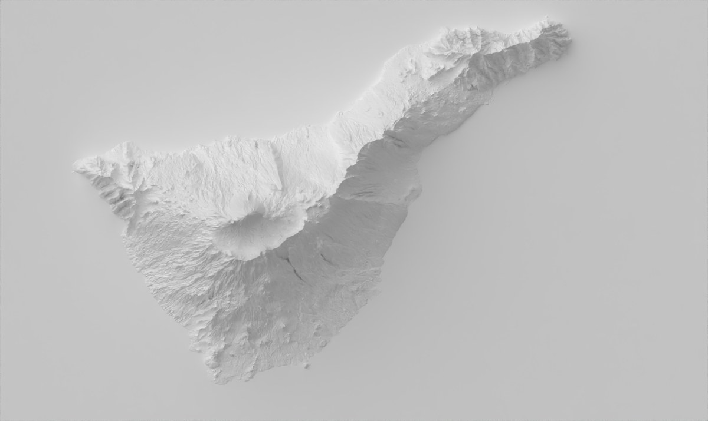 | 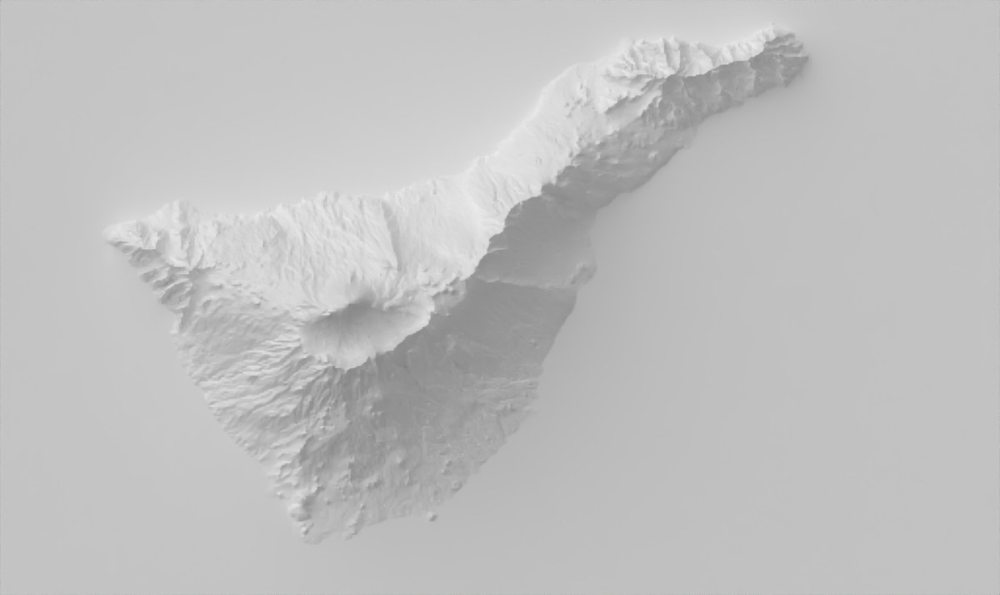 |

> **Values to try:** 2–4 for subtle softening; 6–10 for regional maps where fine detail is not needed. Values above 10 tend to flatten ridges too aggressively.

---

### 9. Fast preview - quick iteration

Iterate quickly without waiting for a full render.

```bash
# Quarter resolution, 32 samples - done in seconds
relievo \
  --bbox examples/bboxes/tenerife_bbox.geojson \
  --template template.blend \
  --output preview.png \
  --scale 25 \
  --samples 32

# Cap longest side to 1 000 px
relievo \
  --bbox examples/bboxes/tenerife_bbox.geojson \
  --template template.blend \
  --output preview.png \
  --max-size 1000 \
  --samples 64
```

---

### 10. Save the DEM and reuse it

Download once, render many times with different templates, sun positions or exaggerations - without hitting the API again.

```bash
# Step 1 - download and process DEM; skip rendering
relievo \
  --bbox examples/bboxes/tenerife_bbox.geojson \
  --template template.blend \
  --no-render \
  --save-dem dem_tenerife.tif \
  --save-processed-dem dem_tenerife_metres.tif   # optional: metres copy for GIS inspection

# Step 2 - render from saved DEM, no internet needed
relievo \
  --bbox examples/bboxes/tenerife_bbox.geojson \
  --template template.blend \
  --dem dem_tenerife.tif \
  --output tenerife_v1.png \
  --light-azimuth 315 --light-altitude 35

relievo \
  --bbox examples/bboxes/tenerife_bbox.geojson \
  --template template.blend \
  --dem dem_tenerife.tif \
  --output tenerife_v2.png \
  --light-azimuth 135 --light-altitude 25 \
  --exaggeration 1.5
```

> **`--save-dem`** saves the raw DEM downloaded from OpenTopography (before crop/reproject/UInt16 conversion), so you can rerun with `--dem` without another API call.
> **`--save-processed-dem`** saves the cropped/reprojected DEM in real metres (before UInt16 conversion) - handy for GIS inspection and statistics. Blender never reads this file directly.

---

### 11. Reproject to a metric CRS

Reprojecting to a projected CRS reduces distortion, especially at high latitudes or for large areas.
`--crs` accepts any string that GDAL understands: EPSG codes, PROJ strings, WKT, etc.

```bash
# Tenerife → UTM zone 28N
relievo \
  --bbox examples/bboxes/tenerife_bbox.geojson \
  --template template.blend \
  --output tenerife_utm.png \
  --crs EPSG:32628

# Norway → UTM zone 33N
relievo \
  --bbox norway.geojson \
  --template template.blend \
  --output norway.png \
  --crs EPSG:32633

# Pyrenees → ETRS89 / UTM zone 31N (official projection for Spain & France in that band)
relievo \
  --bbox pirineos.geojson \
  --dem pirineos.tif \
  --template template.blend \
  --output pirineos.png \
  --crs EPSG:25831
```

#### Custom PROJ string - Albers Equal Area for the Gulf of Oman

For regions not covered by a standard EPSG code, or when you need a tailor-made
equal-area projection, pass a full PROJ string.
The example below uses Albers Equal Area centred on the Gulf of Oman / Iran,
paired with a custom hypsometric ramp (`ramp_hormuz.txt`) that blends
bathymetric blues at sea level into desert ochres at altitude:

```bash
relievo \
  --bbox examples/bboxes/rectangle_iran.geojson \
  --api-key $OPENTOPO_API_KEY \
  --demtype SRTMGL3 \
  --template template.blend \
  --output hormuz_relief.png \
  --color-relief examples/ramp_hormuz.txt \
  --color-relief-mode both \
  --crs "+proj=aea +lat_1=27 +lat_2=37 +lat_0=32 +lon_0=54 +x_0=0 +y_0=0 +datum=WGS84 +units=m +no_defs"
```

**Color ramp `examples/ramp_hormuz.txt`** (excerpt):

```text
nv    0   0   0   0   # nodata → transparent
0    14  60 120       # sea level - deep blue
10   80 155 180       # coastal transition
100 215 195 150       # low desert plains
600 180 155 108       # mid plateau
1500 148 118  78      # mountain flanks
3000 225 215 200      # high peaks
```

<table>
  <tr>
    <th>Shaded relief</th>
    <th>Color layer</th>
    <th>Combined</th>
  </tr>
  <tr>
    <td></td>
    <td></td>
    <td></td>
  </tr>
</table>

---

### 12. Configuration file

Store per-project defaults in a TOML file and keep commands short. Any CLI option can go in the config file.

**`profiles/tenerife.toml`**
```toml
template          = "template.blend"
demtype           = "COP30"
crs               = "EPSG:32628"
exaggeration      = 1.2
light_azimuth     = 315
light_altitude    = 35
samples           = 256
color_ramp        = "examples/ramp_terrain.txt"
color_relief_mode = "both"
```

```bash
# Only specify what changes per run
relievo \
  --config profiles/tenerife.toml \
  --bbox examples/bboxes/tenerife_bbox.geojson \
  --output renders/tenerife_final.png
```

Command-line options always override the config file.

---

### 13. Dry run - estimate without downloading

Preview the bounding box, pixel count and plane dimensions before committing.

```bash
relievo \
  --bbox examples/bboxes/tenerife_bbox.geojson \
  --template template.blend \
  --output tenerife.png \
  --color-relief examples/ramp_terrain.txt \
  --dry-run
```

```
Dry run - nothing will be downloaded or rendered.

  BBox (original):   W=-17.0400  S=27.9400  E=-15.9000  N=28.6200
  BBox (buffered):   W=-17.0970  S=27.9060  E=-15.8430  N=28.6540  (+5%)
  DEM type:          SRTMGL1  (SRTM 30m, 1" / ~30m)
  Estimated pixels:  4177 × 2620
  Blender plane:     4.177 × 2.620 units
  CRS:               (none - no reprojection)
  Render resolution: (from template)  @ 100%
  Color relief:      examples/ramp_terrain.txt  (mode: both)

Output → tenerife.png
```

If you do not pass `--buffer`, `relievo` already adds a **5% buffer by default**. In most cases this avoids hard edge cuts near the map frame.

If you still see odd border cuts in shaded relief (for example because of reprojection/crop edge effects), increase the buffer explicitly.

```bash
# No extra margin (strict bbox)
relievo \
  --bbox examples/bboxes/rectangle_iran.geojson \
  --demtype SRTM15Plus \
  --template template.blend \
  --output docs/images/hormuz_shaded_no_buffer.jpg \
  --crs "+proj=aea +lat_1=27 +lat_2=37 +lat_0=32 +lon_0=54 +x_0=0 +y_0=0 +datum=WGS84 +units=m +no_defs" \
  --buffer 0

# Extra margin around bbox
relievo \
  --bbox examples/bboxes/rectangle_iran.geojson \
  --demtype SRTM15Plus \
  --template template.blend \
  --output docs/images/hormuz_shaded_with_buffer.jpg \
  --crs "+proj=aea +lat_1=27 +lat_2=37 +lat_0=32 +lon_0=54 +x_0=0 +y_0=0 +datum=WGS84 +units=m +no_defs" \
  --buffer 1
```

| `--buffer 0` | `--buffer 1` |
|:---:|:---:|
| 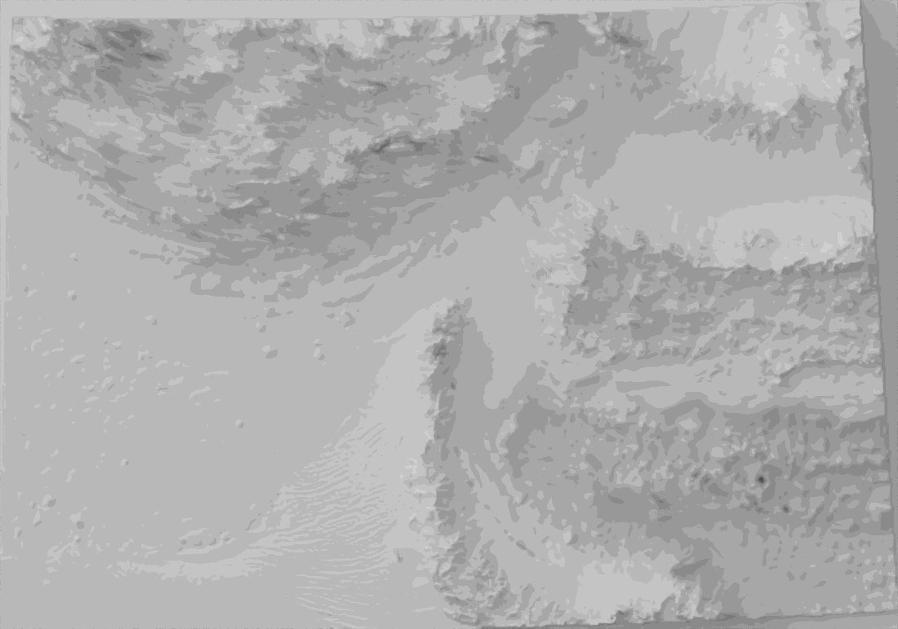 | 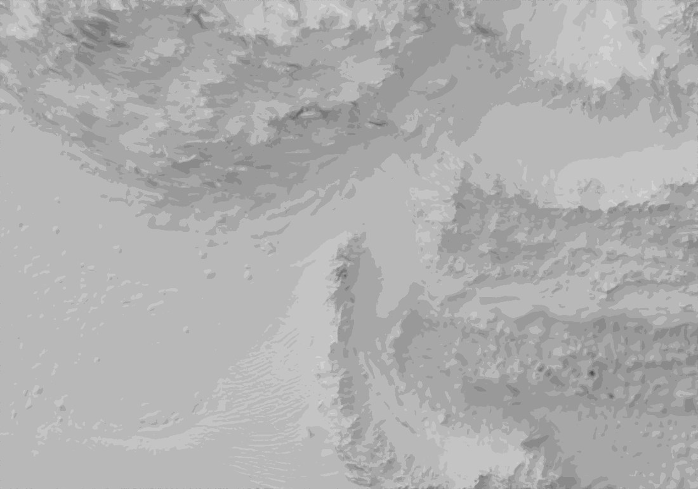 |

---

### 14. Batch processing

```bash
# Sequential
for region in alps pyrenees carpathians; do
  relievo \
    --config profiles/${region}.toml \
    --bbox bboxes/${region}.geojson \
    --output renders/${region}.png
done

# Parallel with GNU parallel
parallel relievo \
  --config profiles/{}.toml \
  --bbox bboxes/{}.geojson \
  --output renders/{}.png \
  ::: alps pyrenees carpathians andes rockies
```

---

## Bounding box format

`--bbox` expects a GeoJSON file with a **Polygon** or **MultiPolygon** in **WGS84 (EPSG:4326)**.

**`examples/bboxes/tenerife_bbox.geojson`**
```json
{
  "type": "FeatureCollection",
  "features": [{
    "type": "Feature",
    "geometry": {
      "type": "Polygon",
      "coordinates": [[
        [-17.04, 27.94],
        [-15.90, 27.94],
        [-15.90, 28.62],
        [-17.04, 28.62],
        [-17.04, 27.94]
      ]]
    }
  }]
}
```

For `--clip-mask`, a non-rectangular polygon that follows a coastline or boundary gives a much cleaner result. Its bounding box is used for the DEM download; the polygon itself is used for the clip.

---

## Creating your own Blender template

The `.blend` file must follow the Daniel Huffman shaded relief setup. The script looks for:

| Element | Requirement |
|---|---|
| Object | Named **`Plane`** |
| Material | **Use Nodes** enabled |
| Texture node | An **Image Texture** node whose **Color** output is connected to displacement |
| Camera | **Orthographic**, pointing straight down (−Z) |
| Light | A **Sun** lamp (required for `--light-azimuth` / `--light-altitude`) |

The included **`template.blend`** is a ready-to-use starting point. Open it in Blender, adjust materials, atmosphere, displacement strength, render settings - then save and use it as your `--template`.

**`relievo` only overrides:**
- Which DEM texture is loaded
- Plane dimensions and camera ortho scale (derived from DEM pixel size)
- Render resolution (`--max-size`, `--scale`)
- Sun rotation (`--light-azimuth`, `--light-altitude`)
- Displacement scale (`--exaggeration`)
- Render samples (`--samples`)

Everything else - look, shading, post-processing nodes, output depth - stays exactly as you set it in the GUI.

---

## Colour ramp format

`--color-relief` expects a plain-text file in [gdaldem color-relief format](https://gdal.org/programs/gdaldem.html). Elevations in **metres**, colours in RGB 0–255.

```
# elevation_m   R    G    B
-500            50   100  200   # deep water
   0            70   130  180   # sea level
   1           194   178  128   # coast / sand
 500           140   180  100   # hills / forest
1500           160   130   90   # sub-alpine
3000           230   220  210   # snow line
5000           255   255  255   # permanent snow
nv               0     0    0   # nodata
```

A ready-to-use ramp is included at **`examples/ramp_terrain.txt`**.

An additional QGIS-inspired option is available at **`examples/ramp_elevation_qgis.txt`** (based on the QGIS Hub "Elevation Ramp" style family).

A soft atlas-style option with subtle blues and warm highlights is available at **`examples/ramp_subtle_atlas.txt`**.

---

## Available DEM datasets

```bash
relievo --list-demtypes
```

| Key | Dataset | Resolution | Coverage |
|---|---|---|---|
| `SRTMGL1` | SRTM 30 m | ~30 m | 56°S – 60°N |
| `SRTMGL3` | SRTM 90 m | ~90 m | 56°S – 60°N |
| `SRTMGL1_E` | SRTM 30 m Ellipsoidal | ~30 m | 56°S – 60°N |
| `AW3D30` | ALOS World 3D | ~30 m | Global |
| `NASADEM` | NASADEM | ~30 m | 56°S – 60°N |
| `COP30` | Copernicus DEM 30 m | ~30 m | Global |
| `COP90` | Copernicus DEM 90 m | ~90 m | Global |
| `SRTM15Plus` | SRTM15+ (bathymetric) | ~500 m | Global (ocean + land) |

> Use `COP30` for areas outside SRTM coverage (Scandinavia, Alaska, high Arctic…).
> Use `SRTM15Plus` for ocean bathymetry - it's the only dataset with negative elevations below sea level.

### Choosing the right resolution

Higher resolution is not always better - it means larger downloads, longer processing times and often no visible improvement at the scale you're mapping. Use the minimum resolution that matches your output scale:

| Map area / scale | Recommended resolution | Suggested dataset |
|---|---|---|
| World map, continent | 500 m – 1 km | `SRTM15Plus`, `COP90` |
| Country, large region (e.g. Iberian Peninsula) | ~90 m | `SRTMGL3`, `COP90` |
| Region, autonomous community | ~30 m | `SRTMGL1`, `COP30`, `NASADEM` |
| Province, metropolitan area | 10–30 m | `COP30`, `AW3D30` |
| Local detail, single city | < 5 m | Your own data (LiDAR, IGN, USGS 1 m…) |

> **Example:** Rendering the entire Iberian Peninsula with `SRTMGL1` (30 m) downloads ~500 MB and produces ~50 000 × 40 000 pixels - yet the visible difference vs. `SRTMGL3` (90 m) at a printed A2 map is zero. Use 90 m and save the bandwidth.

---

## OpenTopography API key

An API key is **only required** when `relievo` downloads the DEM automatically (i.e., `--dem` is not used). If you always supply your own data, no account is needed.

1. Register for free at [opentopography.org](https://opentopography.org/developers)
2. Use your key in any of these ways:

```bash
# Environment variable - set once in your shell profile
export OPENTOPO_API_KEY=your_key_here

# TOML config file
api_key = "your_key_here"

# Per-command
relievo --api-key your_key_here ...
```

### Responsible API use

OpenTopography is a free academic service. Please be a considerate user:

**Download once, render many times.** Save the DEM on the first run and reuse it for all subsequent iterations - different sun angles, exaggeration values or colour ramps won't need a new download.

```bash
# Step 1 - download and save; skip rendering
relievo \
  --bbox my_region.geojson \
  --template template.blend \
  --no-render \
  --save-dem my_region.tif

# Step 2 - render from local file, no API call
relievo \
  --bbox my_region.geojson \
  --template template.blend \
  --dem my_region.tif \
  --output relief.png
```

**Choose the minimum useful resolution.** See the [resolution guide above](#choosing-the-right-resolution) - downloading 30 m data for a continent-scale map wastes bandwidth and produces no visible benefit.

**Respect the [OpenTopography terms of use](https://opentopography.org/usagepolicies).** The API is free but rate-limited. Avoid scripting bulk or repeated downloads of the same area.

---

## Cartographic best practices

> This section draws heavily from Daniel Huffman's essay [**"Towards Less Blender-y Relief"**](https://somethingaboutmaps.wordpress.com/2022/01/13/towards-less-blender-y-relief/) (2022). If you make shaded relief maps, read it.

Blender produces beautiful, photorealistic shading - sometimes *too* beautiful. The "Blender look" is now instantly recognisable: deep shadows, high contrast, every micro-terrain feature rendered in sharp detail. That aesthetic works for some contexts, but it can overwhelm the rest of the map and make terrain harder to read, not easier.

### Avoid over-dramatisation

**Tone down the vertical exaggeration.** It is tempting to push `--exaggeration` up to make terrain look dramatic, but high exaggeration makes all relief look volcanic. As a starting point:

| Terrain type | Suggested `--exaggeration` |
|---|---|
| High mountains (Alps, Tenerife, Andes) | 0.5 – 1.0 |
| Medium relief (Pyrenees, Appalachians) | 1.0 – 1.5 |
| Low hills, coastal plains | 2.0 – 3.5 |
| Flat terrain (deltas, steppes) | 3.5 – 6.0 |

Adjust from there based on your visual judgment - these are departure points, not rules.

**Keep the light angle subtle.** The cartographic convention of NW light (azimuth ~315°, altitude 35–45°) exists for a reason: it reads neutrally. South-facing or very low-angle light creates drama but can make north-facing slopes unreadably dark.

### Smooth the DEM before rendering

Blender faithfully renders every noise artifact, sensor stripe and interpolation glitch in the source data. For regional or national-scale maps, pre-smoothing the DEM eliminates visual clutter and makes large landform structures read more clearly - exactly as traditional hand-drawn relief simplifies and generalises terrain.

Use `--smooth` to apply a low-pass filter built into the pipeline:

```bash
# Factor 4 - subtle softening, good for island or province scale
relievo --dem dem.tif --bbox region.geojson --smooth 4 ...

# Factor 8 - stronger smoothing, suitable for country or region scale
relievo --dem dem.tif --bbox region.geojson --smooth 8 ...
```

See [Smooth the DEM to reduce visual noise](#8-smooth-the-dem-to-reduce-visual-noise) for a side-by-side comparison.

### Relief as background, not foreground

Shaded relief should support the map - labels, roads, boundaries - not compete with it. If your relief is the only element, push the contrast. If it's a basemap layer, pull it back: use `--exaggeration` on the lower end, consider a gentle hypsometric tint (`--color-relief`) to add elevation context without adding shadow drama, and keep the sun angle conventional.

> *"Terrain relief doesn't always need to be dramatic."* - Daniel Huffman

---

## Tips and caveats

**Render speed** - Cycles is GPU-accelerated. Configure Blender under *Preferences → System → Cycles Render Devices*. A 4 K render at 256 samples takes ~60 s on an RTX 3080; ~15 min CPU-only.

**Aspect ratio** - The render resolution automatically adapts to the DEM's natural proportions. Use `--max-size` to control the longest side in pixels without distortion:

```bash
relievo --bbox region.geojson --template relief.blend \
  --output out.png --max-size 4000
```

**Large areas** - OpenTopography rate-limits large requests. For areas wider than ~10°, split into tiles or use a local DEM.

**Blender not on PATH** - Pass the full path:

```bash
# macOS
--blender /Applications/Blender.app/Contents/MacOS/Blender

# Linux
--blender /opt/blender/blender
```

**Debugging** - `--verbose` shows the full GDAL pipeline and Blender log. `--keep-workdir` preserves the temporary directory for inspecting intermediate files.

---

## Notes on authorship and tooling

Most of my background is in frontend work, especially design, visualisation, and graphics. I also work on backend tasks, where I mainly use R for data analysis and automation. I had prior Python experience in geospatial workflows and satellite imagery analysis, but not enough to comfortably build a CLI of this complexity on my own.

This project was developed with strong support from AI-assisted tooling. I used Codex (GPT-5.3) and Claude (Sonnet 4.6) to accelerate implementation and iteration.

To be clear:

- The product direction, workflow design, and key decisions are mine.
- A significant part of the code was reviewed, adapted, and iterated manually.
- Parts of the codebase were heavily assisted by these models.

---

## Development workflow

Install development tooling:

```bash
pip install -e ".[dev]"
pre-commit install
```

Run quality checks manually:

```bash
ruff check relievo/ tests/
pytest tests/ -q
```

Build and validate package artifacts:

```bash
make package
```

The repository keeps only curated binary assets under `docs/images/` plus `template.blend`. Generated renders and temporary rasters should remain local.

---

## Versioning policy

`relievo` follows semantic versioning from the `0.0.1` baseline:

- `0.0.x` for patch fixes and documentation corrections.
- `0.x.0` for backward-compatible feature additions before stable `1.0.0`.
- `1.x.y` after CLI behavior and interfaces are considered stable.

Every release must have a matching changelog entry in `CHANGELOG.md`.
