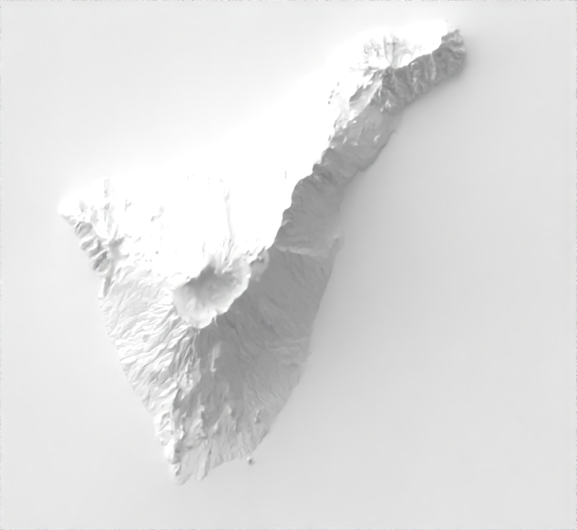
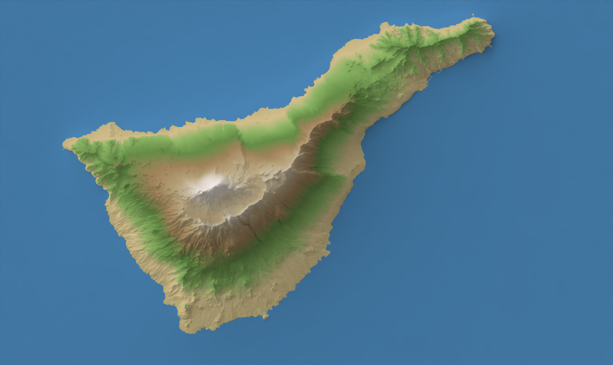
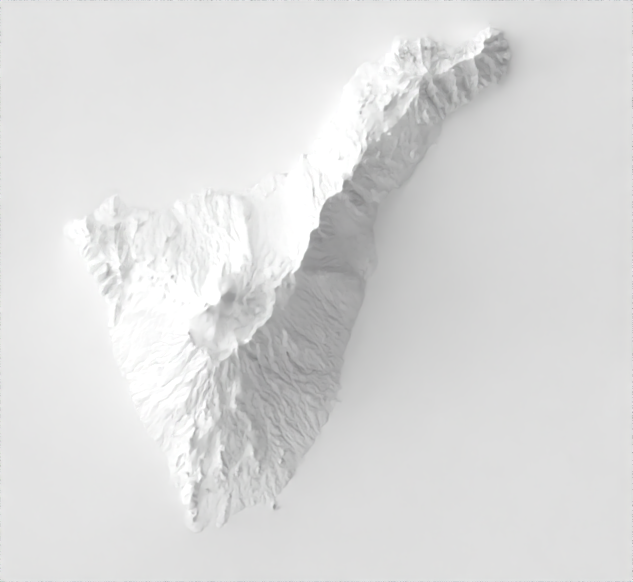
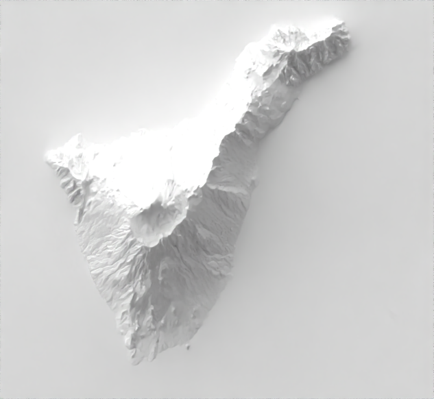
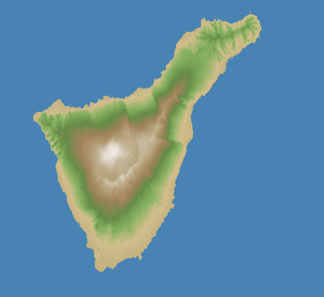
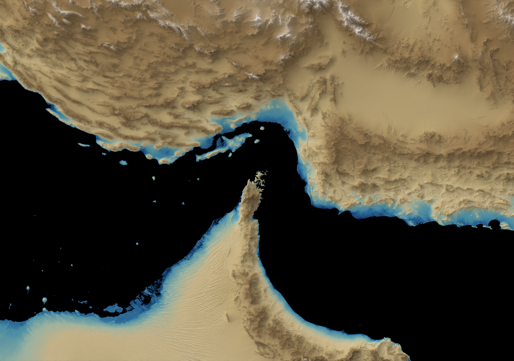
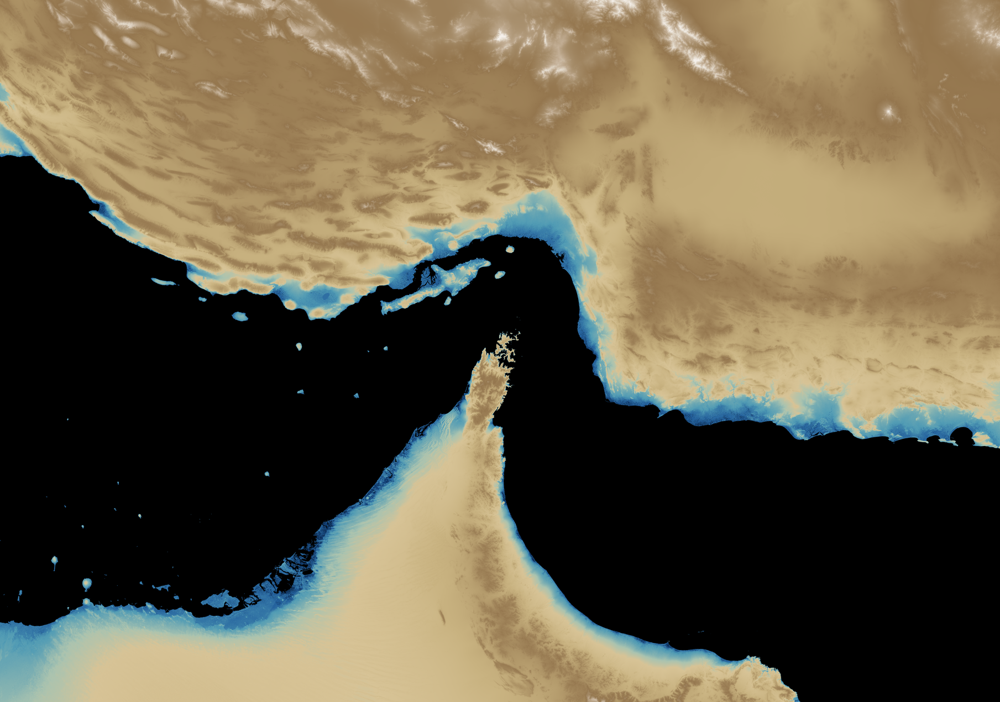

# blender-relief

**Automated shaded relief maps with Blender — from a bounding box to a publication-ready PNG in one command.**

`blender-relief` is a CLI that drives [Daniel Huffman's](https://somethingaboutmaps.wordpress.com/2017/11/16/creating-shaded-relief-in-blender/) shaded relief workflow without touching Blender's GUI. Give it a geographic bounding box and a `.blend` template and it downloads the elevation data, prepares the DEM, runs Blender headlessly and delivers a render. Add `--color-relief` for a hypsometric colour tint, `--clip-mask` to cut the result to your exact polygon and `--color-relief-mode both` to get the composite *and* the raw colour layer — all scriptable, all reproducible.

> **Inspired by** [Daniel Huffman's](https://somethingaboutmaps.wordpress.com/2017/11/16/creating-shaded-relief-in-blender/) Blender method, [Nick Underwood's blenderize.sh](https://github.com/nunderwood6/blender_prep) and Kyaw Naing Win's [OpenTopography DEM Downloader](https://github.com/knwin/OpenTopography-DEM-Downloader-qgis-plugin) QGIS plugin — which pioneered bringing the OpenTopography API directly into a geospatial workflow.

| Shaded relief | + hypsometric tint |
|---|---|
|  |  |

---

## Contents

- [Features](#features)
- [How it works](#how-it-works)
- [Installation](#installation)
- [Quick start](#quick-start)
- [All options](#all-options)
- [Workflows and examples](#workflows-and-examples)
- [Bounding box format](#bounding-box-format)
- [Creating your own Blender template](#creating-your-own-blender-template)
- [Colour ramp format](#colour-ramp-format)
- [Available DEM datasets](#available-dem-datasets)
- [OpenTopography API key](#opentopography-api-key)
- [Tips and caveats](#tips-and-caveats)

---

## Features

- **Zero GUI** — Blender runs headlessly; the whole pipeline is a single shell command.
- **Flexible DEM source** — download automatically from OpenTopography (SRTM 30 m / 90 m, NASADEM, Copernicus 30 m / 90 m, ALOS 30 m…) *or* bring your own GeoTIFF. An API key is only needed for the download step.
- **Hypsometric tint** — composites a colour-by-elevation layer over the render using multiply blending, with three output modes: `overlay`, `separate`, `both`.
- **Polygon clipping** — cuts the output to any GeoJSON polygon with full alpha transparency.
- **Configurable lighting** — override sun azimuth and altitude without touching Blender.
- **Vertical exaggeration** — dial in the drama.
- **Resolution control** — `--max-size` and `--scale` for everything from quick 10-second previews to print-quality renders.
- **TOML config profiles** — keep per-project defaults in a file; no more long commands.
- **Dry run** — preview the download size and pixel count before committing.
- **CRS reprojection** — reproject the DEM to any metric CRS before rendering.

---

## How it works

```
GeoJSON bbox
     │
     ▼
 Download DEM          ← OpenTopography API (optional — only needed without --dem)
 (or load local)       ← any GeoTIFF with --dem; no API key required
     │
     ▼
 Process DEM           ← reproject (optional), rescale to UInt16 (Blender-compatible)
     │
     ▼
 Blender (headless)    ← loads .blend template, applies DEM as displacement map
     │
     ▼
 Post-processing       ← hypsometric tint (gdaldem), polygon clip (Pillow)
     │
     ▼
 output.png
```

The Blender step follows the [Daniel Huffman shaded relief method](https://somethingaboutmaps.wordpress.com/2017/11/16/creating-shaded-relief-in-blender/): the DEM drives a displacement map on a flat plane lit by a sun lamp; an orthographic camera renders the scene from above.

---

## Installation

### Prerequisites

| Dependency | Required for | How to install |
|---|---|---|
| Python ≥ 3.9 | core | conda / pyenv |
| GDAL ≥ 3.6 | DEM processing | **conda-forge only** |
| Blender ≥ 3.6 | rendering | [blender.org](https://www.blender.org/download/) |
| `gdaldem` | `--color-relief` | included with GDAL |
| OpenTopography API key | automatic DEM download | [opentopography.org](https://opentopography.org/developers) — free |

> GDAL must be installed through **conda-forge**. `pip install gdal` is not reliable.

### Conda (recommended)

```bash
git clone https://github.com/youruser/blender-cli-relief.git
cd blender-cli-relief

conda env create -f environment.yml
conda activate blender-relief
pip install -e .
```

### Manual

```bash
conda create -n blender-relief -c conda-forge python=3.11 gdal pyproj
conda activate blender-relief
pip install -e .
```

### Verify

```bash
blender-relief --help
blender-relief --list-datasets
```

---

## Quick start

```bash
export OPENTOPO_API_KEY=your_key_here   # only needed if downloading the DEM automatically

blender-relief \
  --bbox examples/tenerife_bbox.geojson \
  --template tenerife_template.blend \
  --output tenerife.png
```

No API key? Pass your own DEM — no account needed:

```bash
blender-relief \
  --bbox examples/tenerife_bbox.geojson \
  --template tenerife_template.blend \
  --dem /data/my_dem.tif \
  --output tenerife.png
```

---

## All options

```
Usage: blender-relief [OPTIONS]

Options:
  --config FILE                TOML config file with default option values.
  --list-datasets              List all available DEM datasets and exit.
  --bbox FILE                  GeoJSON bounding box polygon in WGS84.  [required]
  --template FILE              Path to the .blend template file.  [required]
  --output FILE                Output PNG file path.  [default: output.png]
  --buffer FLOAT               Buffer added to bbox before downloading (e.g. 0.05 = 5%).
  --dem FILE                   Local DEM GeoTIFF — skips the download step entirely.
  --save-dem FILE              Save the processed DEM for later reuse with --dem.
  --crs TEXT                   Reproject DEM to this CRS before rendering (e.g. EPSG:32628).
  --demtype TEXT               OpenTopography dataset key.  [default: SRTMGL1]
  --api-key TEXT               OpenTopography API key (or OPENTOPO_API_KEY env var).
  --exaggeration FLOAT         Vertical exaggeration factor.
  --samples INT                Blender Cycles render samples.
  --max-size INT               Maximum pixels on the longest side of the output.
  --scale INT                  Render resolution percentage (1–100).  [default: 100]
  --light-azimuth FLOAT        Sun azimuth in degrees (0 = North, clockwise).
  --light-altitude FLOAT       Sun altitude in degrees (0 = horizon, 90 = overhead).
  --color-relief FILE          gdaldem colour ramp file for hypsometric tint.
  --color-relief-mode TEXT     overlay | separate | both.  [default: overlay]
  --clip-mask                  Clip output to the GeoJSON polygon shape (RGBA).
  --dry-run                    Print estimated download/render info and exit.
  --no-render                  Download and process DEM only; skip Blender.
  --blender-bin PATH           Path to the Blender executable.
  --verbose                    Detailed progress log.
  --keep-workdir               Keep the temporary working directory after render.
  --help                       Show this message and exit.
```

---

## Gallery

All examples below use **`examples/tenerife_bbox.geojson`** and **`dem.tif`** (pre-downloaded) as input. No API key required.

---

### Shaded relief only

```bash
blender-relief \
  --bbox examples/tenerife_bbox.geojson \
  --template tenerife_template.blend \
  --dem dem.tif \
  --output relieve.png
```


---

### + Hypsometric tint (`--color-relief-mode overlay`)

```bash
blender-relief \
  --bbox examples/tenerife_bbox.geojson \
  --template tenerife_template.blend \
  --dem dem.tif \
  --output relieve.png \
  --color-relief examples/ramp_terrain.txt
```


---

### Light from the NW vs south

```bash
# NW light — cartographic convention
blender-relief ... --light-azimuth 315 --light-altitude 35

# South light — dramatic, reveals north-facing slopes
blender-relief ... --light-azimuth 180 --light-altitude 18
```

| NW (315°, 35°) | South (180°, 18°) |
|---|---|
|  |  |

---

### `--color-relief-mode both` — composite + raw colour layer

```bash
blender-relief \
  --bbox examples/tenerife_bbox.geojson \
  --template tenerife_template.blend \
  --dem dem.tif \
  --output relieve.png \
  --color-relief examples/ramp_terrain.txt \
  --color-relief-mode both
# → relieve.png        shaded relief + tint
# → relieve_color.png  raw colour layer for further compositing
```

| Composite | Raw colour layer |
|---|---|
|  |  |

---

## Workflows and examples

### 1. Minimal — download + render

The simplest invocation. The OpenTopography API key is only used here.

```bash
blender-relief \
  --bbox examples/tenerife_bbox.geojson \
  --template tenerife_template.blend \
  --output tenerife.png
```

---

### 2. Using your own DEM

Skip the download entirely. Any GeoTIFF works — local surveys, IGN, Copernicus Land Monitor, USGS, whatever you have. No API key required.

```bash
blender-relief \
  --bbox examples/tenerife_bbox.geojson \
  --template tenerife_template.blend \
  --dem /data/mdt05-canarias.tif \
  --output tenerife.png
```

> `--bbox` is still used to crop the DEM to the area of interest.

---

### 3. Hypsometric colour tint

Composite a colour-by-elevation layer over the render using multiply blending. Requires `gdaldem` (ships with any GDAL install).

```bash
blender-relief \
  --bbox examples/tenerife_bbox.geojson \
  --template tenerife_template.blend \
  --output tenerife.png \
  --color-relief examples/ramp_terrain.txt
```

The included `examples/ramp_terrain.txt` covers −500 m (deep water) to 5 000 m (permanent snow). Edit elevation breakpoints and colours freely.

---

### 4. Separate colour layer for compositing

Get the shaded render and the colour layer as independent files — perfect for further compositing in Photoshop, Affinity Photo or GIMP.

```bash
# Both composite and raw colour layer
blender-relief \
  --bbox examples/tenerife_bbox.geojson \
  --template tenerife_template.blend \
  --output tenerife.png \
  --color-relief examples/ramp_terrain.txt \
  --color-relief-mode both
# → tenerife.png        shaded relief + tint composited
# → tenerife_color.png  raw colour layer, no shading

# Only the colour layer — render left untouched
blender-relief \
  --bbox examples/tenerife_bbox.geojson \
  --template tenerife_template.blend \
  --output tenerife.png \
  --color-relief examples/ramp_terrain.txt \
  --color-relief-mode separate
# → tenerife.png        shaded relief, untouched
# → tenerife_color.png  raw colour layer
```

---

### 5. Clip to an irregular polygon

Cut the output to any shape — coastlines, administrative boundaries, watersheds — with full alpha transparency.

```bash
blender-relief \
  --bbox examples/tenerife_bbox.geojson \
  --template tenerife_template.blend \
  --output tenerife_clipped.png \
  --clip-mask
```

The clip shape is taken from `--bbox`. For precise cuts, supply a polygon that follows the actual coastline or boundary rather than a rectangular bbox.

---

### 6. Custom sun position

Override the light direction without opening Blender.

```bash
# Classic NW light (standard cartographic convention)
blender-relief \
  --bbox examples/tenerife_bbox.geojson \
  --template tenerife_template.blend \
  --output tenerife_nw.png \
  --light-azimuth 315 \
  --light-altitude 35

# Low, dramatic south light
blender-relief \
  --bbox examples/tenerife_bbox.geojson \
  --template tenerife_template.blend \
  --output tenerife_south.png \
  --light-azimuth 180 \
  --light-altitude 15
```

---

### 7. Vertical exaggeration

Amplify or flatten terrain drama.

```bash
# Subtle — good for high-relief areas like the Alps or Tenerife
blender-relief --bbox ... --template ... --output out.png --exaggeration 0.6

# Strong — good for flat areas like deltas or coastal plains
blender-relief --bbox ... --template ... --output out.png --exaggeration 3.0
```

---

### 8. Fast preview

Iterate quickly without waiting for a full render.

```bash
# Quarter resolution, 32 samples — done in seconds
blender-relief \
  --bbox examples/tenerife_bbox.geojson \
  --template tenerife_template.blend \
  --output preview.png \
  --scale 25 \
  --samples 32

# Cap longest side to 1 000 px
blender-relief \
  --bbox examples/tenerife_bbox.geojson \
  --template tenerife_template.blend \
  --output preview.png \
  --max-size 1000 \
  --samples 64
```

---

### 9. Save the DEM and reuse it

Download once, render many times with different templates, sun positions or exaggerations — without hitting the API again.

```bash
# Step 1 — download and process DEM; skip rendering
blender-relief \
  --bbox examples/tenerife_bbox.geojson \
  --template tenerife_template.blend \
  --no-render \
  --save-dem dem_tenerife.tif

# Step 2 — render from saved DEM, no internet needed
blender-relief \
  --bbox examples/tenerife_bbox.geojson \
  --template tenerife_template.blend \
  --dem dem_tenerife.tif \
  --output tenerife_v1.png \
  --light-azimuth 315 --light-altitude 35

blender-relief \
  --bbox examples/tenerife_bbox.geojson \
  --template tenerife_template.blend \
  --dem dem_tenerife.tif \
  --output tenerife_v2.png \
  --light-azimuth 135 --light-altitude 25 \
  --exaggeration 1.5
```

---

### 10. Reproject to a metric CRS

Reprojecting to a projected CRS reduces distortion, especially at high latitudes or for large areas.
`--crs` accepts any string that GDAL understands: EPSG codes, PROJ strings, WKT, etc.

```bash
# Tenerife → UTM zone 28N
blender-relief \
  --bbox examples/tenerife_bbox.geojson \
  --template tenerife_template.blend \
  --output tenerife_utm.png \
  --crs EPSG:32628

# Norway → UTM zone 33N
blender-relief \
  --bbox norway.geojson \
  --template tenerife_template.blend \
  --output norway.png \
  --crs EPSG:32633

# Pyrenees → ETRS89 / UTM zone 31N (official projection for Spain & France in that band)
blender-relief \
  --bbox pirineos.geojson \
  --dem pirineos.tif \
  --template template.blend \
  --output pirineos.png \
  --crs EPSG:25831
```

#### Custom PROJ string — Albers Equal Area for the Gulf of Oman

For regions not covered by a standard EPSG code, or when you need a tailor-made
equal-area projection, pass a full PROJ string.
The example below uses Albers Equal Area centred on the Gulf of Oman / Iran,
paired with a custom hypsometric ramp (`ramp_hormuz.txt`) that blends
bathymetric blues at sea level into desert ochres at altitude:

```bash
blender-relief \
  --bbox rectangle_iran.geojson \
  --api-key $OPENTOPO_API_KEY \
  --demtype SRTMGL3 \
  --template template.blend \
  --output hormuz_relief.png \
  --color-relief examples/ramp_hormuz.txt \
  --color-relief-mode both \
  --crs "+proj=aea +lat_1=27 +lat_2=37 +lat_0=32 +lon_0=54 +x_0=0 +y_0=0 +datum=WGS84 +units=m +no_defs"
```

**Color ramp `examples/ramp_hormuz.txt`** (excerpt):

```text
nv    0   0   0   0   # nodata → transparent
0    14  60 120       # sea level — deep blue
10   80 155 180       # coastal transition
100 215 195 150       # low desert plains
600 180 155 108       # mid plateau
1500 148 118  78      # mountain flanks
3000 225 215 200      # high peaks
```

| Shaded relief | Color overlay |
|:---:|:---:|
|  |  |

---

### 11. Configuration file

Store per-project defaults in a TOML file and keep commands short. Any CLI option can go in the config file.

**`profiles/tenerife.toml`**
```toml
template          = "tenerife_template.blend"
demtype           = "COP30"
crs               = "EPSG:32628"
exaggeration      = 1.2
light_azimuth     = 315
light_altitude    = 35
samples           = 256
color_ramp        = "examples/ramp_terrain.txt"
color_relief_mode = "both"
```

```bash
# Only specify what changes per run
blender-relief \
  --config profiles/tenerife.toml \
  --bbox examples/tenerife_bbox.geojson \
  --output renders/tenerife_final.png
```

Command-line options always override the config file.

---

### 12. Dry run — estimate without downloading

Preview the bounding box, pixel count and plane dimensions before committing.

```bash
blender-relief \
  --bbox examples/tenerife_bbox.geojson \
  --template tenerife_template.blend \
  --output tenerife.png \
  --color-relief examples/ramp_terrain.txt \
  --dry-run
```

```
Dry run — nothing will be downloaded or rendered.

  BBox (original):   W=-17.0400  S=27.9400  E=-15.9000  N=28.6200
  BBox (buffered):   W=-17.0970  S=27.9060  E=-15.8430  N=28.6540  (+5%)
  DEM type:          SRTMGL1  (SRTM 30m, 1" / ~30m)
  Estimated pixels:  4177 × 2620
  Blender plane:     4.177 × 2.620 units
  CRS:               (none — no reprojection)
  Render resolution: (from template)  @ 100%
  Color relief:      examples/ramp_terrain.txt  (mode: both)

Output → tenerife.png
```

---

### 13. Batch processing

```bash
# Sequential
for region in alps pyrenees carpathians; do
  blender-relief \
    --config profiles/${region}.toml \
    --bbox bboxes/${region}.geojson \
    --output renders/${region}.png
done

# Parallel with GNU parallel
parallel blender-relief \
  --config profiles/{}.toml \
  --bbox bboxes/{}.geojson \
  --output renders/{}.png \
  ::: alps pyrenees carpathians andes rockies
```

---

## Bounding box format

`--bbox` expects a GeoJSON file with a **Polygon** or **MultiPolygon** in **WGS84 (EPSG:4326)**.

**`examples/tenerife_bbox.geojson`**
```json
{
  "type": "FeatureCollection",
  "features": [{
    "type": "Feature",
    "geometry": {
      "type": "Polygon",
      "coordinates": [[
        [-17.04, 27.94],
        [-15.90, 27.94],
        [-15.90, 28.62],
        [-17.04, 28.62],
        [-17.04, 27.94]
      ]]
    }
  }]
}
```

For `--clip-mask`, a non-rectangular polygon that follows a coastline or boundary gives a much cleaner result. Its bounding box is used for the DEM download; the polygon itself is used for the clip.

---

## Creating your own Blender template

The `.blend` file must follow the [Daniel Huffman shaded relief setup](https://somethingaboutmaps.wordpress.com/2017/11/16/creating-shaded-relief-in-blender/). The script looks for:

| Element | Requirement |
|---|---|
| Object | Named **`Plane`** |
| Material | **Use Nodes** enabled |
| Texture node | An **Image Texture** node whose **Color** output is connected to displacement |
| Camera | **Orthographic**, pointing straight down (−Z) |
| Light | A **Sun** lamp (required for `--light-azimuth` / `--light-altitude`) |

The included **`tenerife_template.blend`** is a ready-to-use starting point. Open it in Blender, adjust materials, atmosphere, displacement strength, render settings — then save and use it as your `--template`.

**`blender-relief` only overrides:**
- Which DEM texture is loaded
- Plane dimensions and camera ortho scale (derived from DEM pixel size)
- Render resolution (`--max-size`, `--scale`)
- Sun rotation (`--light-azimuth`, `--light-altitude`)
- Displacement scale (`--exaggeration`)
- Render samples (`--samples`)

Everything else — look, shading, post-processing nodes, output depth — stays exactly as you set it in the GUI.

---

## Colour ramp format

`--color-relief` expects a plain-text file in [gdaldem color-relief format](https://gdal.org/programs/gdaldem.html). Elevations in **metres**, colours in RGB 0–255.

```
# elevation_m   R    G    B
-500            50   100  200   # deep water
   0            70   130  180   # sea level
   1           194   178  128   # coast / sand
 500           140   180  100   # hills / forest
1500           160   130   90   # sub-alpine
3000           230   220  210   # snow line
5000           255   255  255   # permanent snow
nv               0     0    0   # nodata
```

A ready-to-use ramp is included at **`examples/ramp_terrain.txt`**.

---

## Available DEM datasets

```bash
blender-relief --list-datasets
```

| Key | Dataset | Resolution | Coverage |
|---|---|---|---|
| `SRTMGL1` | SRTM 30 m | ~30 m | 56°S – 60°N |
| `SRTMGL3` | SRTM 90 m | ~90 m | 56°S – 60°N |
| `SRTMGL1_E` | SRTM 30 m Ellipsoidal | ~30 m | 56°S – 60°N |
| `AW3D30` | ALOS World 3D | ~30 m | Global |
| `NASADEM` | NASADEM | ~30 m | 56°S – 60°N |
| `COP30` | Copernicus DEM 30 m | ~30 m | Global |
| `COP90` | Copernicus DEM 90 m | ~90 m | Global |

> Use `COP30` for areas outside SRTM coverage (Scandinavia, Alaska, high Arctic…).

---

## OpenTopography API key

An API key is **only required** when `blender-relief` downloads the DEM automatically (i.e., `--dem` is not used). If you always supply your own data, no account is needed.

1. Register for free at [opentopography.org](https://opentopography.org/developers)
2. Use your key in any of these ways:

```bash
# Environment variable — set once in your shell profile
export OPENTOPO_API_KEY=your_key_here

# TOML config file
api_key = "your_key_here"

# Per-command
blender-relief --api-key your_key_here ...
```

---

## Tips and caveats

**Render speed** — Cycles is GPU-accelerated. Configure Blender under *Preferences → System → Cycles Render Devices*. A 4 K render at 256 samples takes ~60 s on an RTX 3080; ~15 min CPU-only.

**Aspect ratio** — If your DEM's aspect ratio differs from the template's render resolution, thin black bands may appear at the edges. Use `--max-size` to force the render resolution to match the DEM's natural proportions:

```bash
blender-relief --bbox region.geojson --template relief.blend \
  --output out.png --max-size 4000
```

**Large areas** — OpenTopography rate-limits large requests. For areas wider than ~10°, split into tiles or use a local DEM.

**Blender not on PATH** — Pass the full path:

```bash
# macOS
--blender-bin /Applications/Blender.app/Contents/MacOS/Blender

# Linux
--blender-bin /opt/blender/blender
```

**Debugging** — `--verbose` shows the full GDAL pipeline and Blender log. `--keep-workdir` preserves the temporary directory for inspecting intermediate files.
